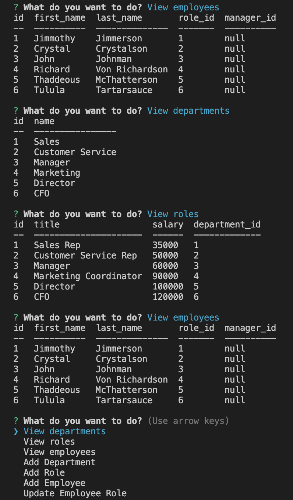

# Staff Master - Employee Tracker

## Description
StaffMaster is an efficient command line application designed for seamless management of departments, roles, and employees. With a user-friendly interface that supports easy navigation using the up and down keys on your computer keyboard, StaffMaster simplifies administrative tasks. You can effortlessly view departments, roles, and employees, add new entities, and update employee roles.

With StaffMaster, accessing information becomes intuitive as you navigate through the application using the up and down keys on your keyboard. This streamlined approach allows for quick and efficient browsing of department, role, and employee lists. Additionally, adding new departments, roles, and employees is a breeze with dedicated commands that ensure data integrity and prevent duplication.

When it comes to updating an employee's role, StaffMaster offers a straightforward solution. By entering the appropriate command and utilizing the up and down keys to select the employee, you can easily modify their role, ensuring accurate representation of their responsibilities within the organization.

In summary, StaffMaster is a command line application that revolutionizes department, role, and employee management. Its user-friendly interface, coupled with the ability to navigate using the up and down keys on your keyboard, makes it easy to view, add, and update entities. With StaffMaster, you can streamline administrative tasks and enhance productivity within your organization.

## Table of Contents
- ScreenCastify demo
- Images
- Installation
- Built with..
- Attributes and Acknowledgements
- License

## ScreenCastify 
Demo
.gif)
## Images
Main Page 

## Installation
Clone this code from GitHub.  Install all packages, source the schema and seed the database.  Quit the mysql and run the app from the terminal.

## Built with...
This application was built JavaScript and MySQL

## Attributes and Acknowledgements
This application was built with the help of Chat GPT, Juan Delgado(Tutor) and UT Austin Bootcamp curriculum.

## License

